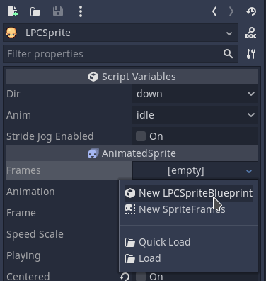
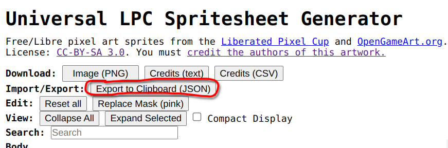
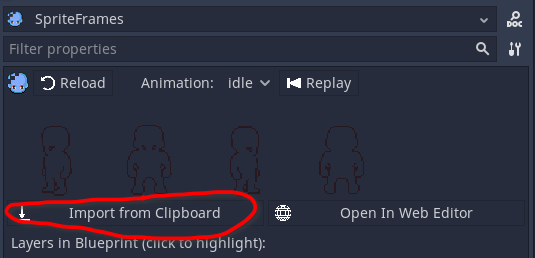
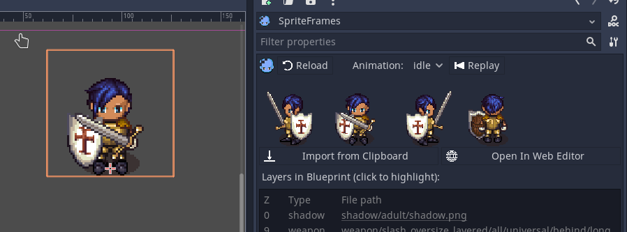

# Godot_LPC_Spritesheet_Gen
This plugin is used to __import__ spritesheets generateed with the [Universal LPC Spritesheet Character Generator](https://sanderfrenken.github.io/Universal-LPC-Spritesheet-Character-Generator/) into godot.
The plugin also offers the [LPCSprite](lps_sprite.gd) Class for easy animation of the characters in your game.

## Basics
Thera are two main classes:
- [LPCSpriteBlueprint](lps_sprite_blueprint.gd) Holds the various spritesheet layers and supported animations
- [LPCSprite](lps_sprite.gd) Uses the [LPCSpriteBlueprint](lps_sprite_blueprint.gd) to play the animations during runtime

## Workflow
The work flow is as simple as:

- Create an instance of [LPCSprite](lps_sprite.gd) 
- Set the `frames` property to a new [LPCSpriteBlueprint](lps_sprite_blueprint.gd) instance or load an existing one 
- Select the `SpriteFrames` property (which brings you to the plugin) 

Your empty Blueprint should look like this:

- Generate your Spritesheet
  - Go to https://sanderfrenken.github.io/Universal-LPC-Spritesheet-Character-Generator/
  - Generate a character as you like from over 15,000 Sprites
  - Press "Export to Clipboard" button 

- Import it in Godot
  - Click "Import from Clipboard"  
  - Now you can test your LPCSprite  

## Usage of the `LPCSprite` class
- Checkout the [demo](demo) where you can strike down a skeleton endlessly.
- The contained scripts show some basic usage, like:
  - use `set_anim()` so set an ainimation
  - use `animate_movement()` to make LPCSprite pick an animation based on your motion vector
  - react to signal `"animation_climax"` to e.g. deal damage at the climax point of an animation
  - use `get_layers()` and functions like `set_glow()` or `set_highlight()` to animate the material of some layers

## Additional information
- You are responsible to comply with the license terms of the art you use
- 
